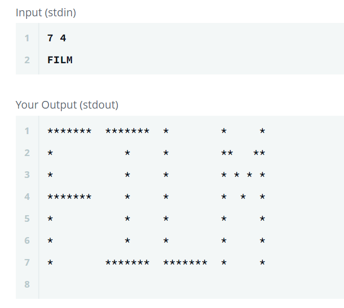

# Pattern-printing-with-C [](http://makeapullrequest.com) [](http://www.firsttimersonly.com/)

Printing capital alphabets with C language.

```C
Sample input
n l
s
where
n- Number of rows in the output
l- input length
s- input string
```

Refer the below screenshot.



## 🧐 What's inside?

1.  **`Individual patterns`**: This directory contains all the individual patterns.
2.  **`Main.c`**: This file contains a code combined of all the patterns.

**`Note`**: There is no relation between **`Individual patterns`** directory and **`Main.c`**.

Adding code directly to Main.c file is little tedious for beginners that's why created separate files for each pattern.

## Want to contribute this project?

That's why we here! 😀

Please **use a branch** and [create a PR](https://help.github.com/articles/creating-a-pull-request/). If you are raising pull request for the first time watch [this](https://www.youtube.com/watch?v=rgbCcBNZcdQ) 5 mins video.

Haven't time to code it? Please open an [issue](https://github.com/rahulparshi/Pattern-printing-with-C/issues/new).

Use branch name and file name in **`Individual patterns`** directory same as the pattern name like (k.c, J.c).

Thank you for taking the time to contribute! 👍
